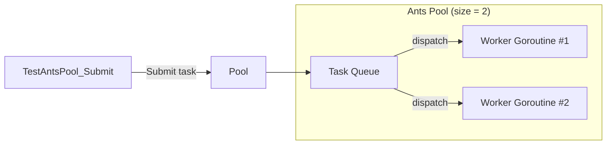
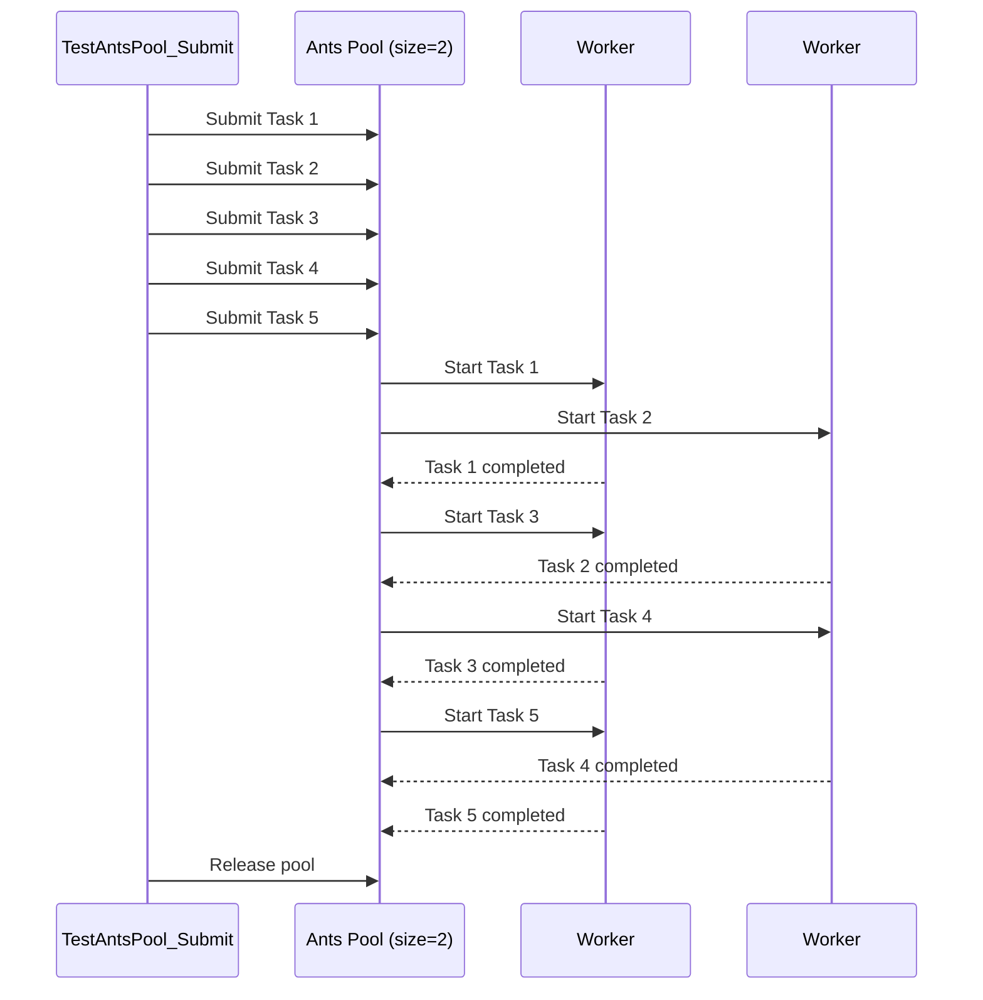

# Worker Pool Architecture (ants)

This document explains how the **ants-based worker pool** works in this project, using a real test case and execution logs.

The goal is to demonstrate **bounded concurrency**, **task queuing**, and **worker reuse**.

---

## Test Scenario

- Test in `internal/infrastructure/workerpool/ants_pool_test.go`:

```go
pool, _ := NewAntsPool(2) // pool size = 2

// submit 5 tasks
for i := 0; i < 5; i++ {
    pool.Submit(func() {
        time.Sleep(10 * time.Millisecond)
    })
}
```

* Pool size: **2**
* Submitted tasks: **5**
* Expected behavior:

  * At most **2 tasks execute concurrently**
  * Remaining tasks are queued
  * All tasks eventually complete

---

## High-Level Architecture



### Explanation

* The test submits tasks to the pool.
* The pool immediately schedules tasks to **available workers**.
* If all workers are busy, tasks wait in the **queue**.
* Workers are reused after task completion.

---

## Execution Timeline (Matches Test Logs)



### Why logs appear interleaved

* Workers run concurrently
* Log lines are emitted from different goroutines
* Ordering reflects **scheduler timing**, not submission order

This behavior is **expected and correct**.

---

## Key Guarantees

* **Bounded concurrency**
  Only `N` workers run at the same time.

* **No goroutine leaks**
  Workers are reused and released properly.

* **Deterministic completion**
  `sync.WaitGroup` ensures all tasks finish.

* **Backpressure**
  Tasks block or queue instead of spawning unlimited goroutines.

---

## Why ants is used

| Feature         | Benefit            |
| --------------- | ------------------ |
| Goroutine reuse | Lower GC pressure  |
| Fixed pool size | Prevents overload  |
| Internal queue  | Smooth task bursts |
| Fast scheduling | Production-ready   |

---

## Summary

> Even though 5 tasks are submitted, only 2 run concurrently.
> The remaining tasks wait in the queue until a worker becomes available.

This is the core behavior that makes the worker pool safe for:

* AWS S3
* Databases
* External APIs
* Any I/O-bound workload
